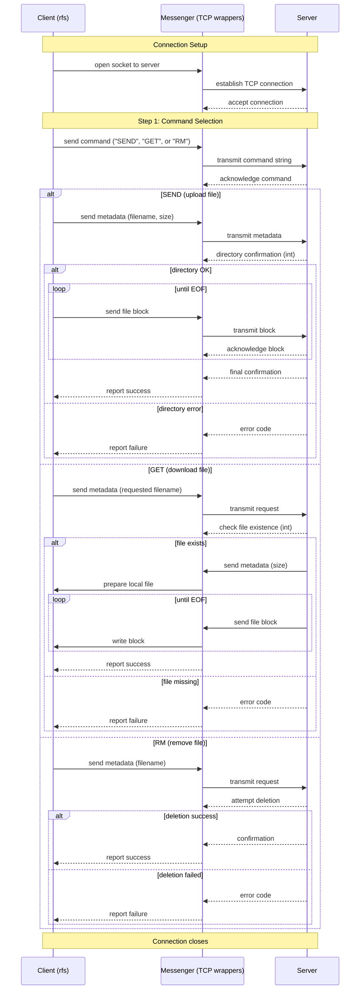

# Remote File Server (RFS) in C

This repository contains a complete TCP client-server application written in **C**, demonstrating low-level systems programming, socket communication, concurrency, synchronization, and file I/O.  

The project implements a **remote file service** where clients can:
- Upload files to the server (`WRITE`)
- Download files from the server (`GET`)
- Delete files from the server (`RM`)

It also includes a **concurrency stress-test driver** to validate correctness under randomized, parallel workloads.

---

## 📂 Repository Structure

```
.
├── client/                  # Client-side executable output
│   ├── backup/              # Backup files for reset rule
│   └── rfs                  # Compiled client executable
├── server/                  # Server-side executable output
│   ├── backup/              # Backup files for reset rule
│   └── server               # Compiled server executable
├── src/
│   ├── client/client.c      # Client implementation
│   ├── server/server.c      # Server implementation
│   ├── messenger.c          # Message passing and file transfer
│   ├── queue.c              # Generic circular queue
│   ├── waitingroom.c        # Threaded waiting room for requests
│   └── concurrency_driver.c # Stress-test driver
├── include/                 # Header files
├── build/                   # Compiled object files
├── Makefile                 # Build automation
└── README.md                # This file

```
---

## Source File Explanations

### 1. `client.c`
The **client program** (`rfs`) issues commands to the server:
- **WRITE**: Uploads a local file to the server.
- **GET**: Downloads a file from the server.
- **RM**: Removes a file from the server.

Key aspects:
- Implements a **handshake protocol** (`GO` → `CONTINUE`) to ensure synchronization before file transfer.
- Provides detailed error handling (`handle_error`) that logs, informs the server, and cleans up resources.
- Encapsulates command-specific logic:
  - `handle_write()` → sends a file and waits for server acknowledgment.
  - `handle_get()` → receives a file and confirms success.
  - `handle_rm()` → receives server confirmation of deletion.
- Demonstrates **socket lifecycle management**: connect → transact → close.

---

### 2. `server.c`
The **server program** (`server/server`) listens for client connections and executes commands.

Key aspects:
- Uses `accept()` to handle multiple incoming client sockets.
- Delegates requests to the **waiting room** (threaded request queue).
- Command handlers:
  - `handle_write()` → receives a file and saves it to disk.
  - `handle_get()` → sends a file to the client and waits for confirmation.
  - `handle_rm()` → deletes a file and responds with success/failure.
- Gracefully shuts down on `SIGINT` (Ctrl+C), cleaning up sockets and threads.
- Validates handshake messages (`GO`, `CONTINUE`) before acting.

This file demonstrates **robust server-side socket programming** and **safe multi-threading**.

---

### 3. `messenger.c`
This module abstracts **low-level TCP communication**:
- `send_msg` / `receive_msg`: Reliable string-based messaging.
- `send_file` / `receive_file`: File transfer with progress bar output.
- Uses `stat`, `fread`, `fwrite`, and system calls to validate directories and write safely.
- Implements **dynamic memory management** (`malloc`, `realloc`, `free`) with safety macros.
- Features **I/O multiplexing** concepts (ensures synchronization between sender/receiver).

This file demonstrates **buffer management**, **robust error handling**, and **system-level I/O**.

---

### 4. `queue.c`
Implements a **generic circular doubly-linked queue**:
- `push()` → enqueue new requests.
- `pop()` → dequeue requests in FIFO order.
- `remove_node()` → arbitrary removal with pointer repair.
- `destroy_queue()` → free all resources.

This queue underpins the waiting room, making it possible to process per-file request queues safely.

---

### 5. `waitingroom.c`
The **waiting room** coordinates **multi-threaded request handling**:
- Maps each file to a **dedicated worker thread** (`file_handler_t`).
- Each worker thread:
  - Waits on a condition variable.
  - Processes requests sequentially (preserves per-file ordering).
  - Terminates when no requests remain.
- Uses `pthread_mutex_t` and `pthread_cond_t` for safe synchronization.
- `make_request()` ensures new threads are created when a file is first accessed.

This demonstrates **concurrency control**, **thread lifecycle management**, and **fine-grained synchronization** in C.

---

### 6. `concurrency_driver.c`
The **stress test driver** validates concurrency under load:
- Spawns child processes that randomly issue `WRITE`, `GET`, and `RM` requests against the server.
- Builds randomized filenames and command arguments.
- Uses `fork()` and `execvp()` to run the `rfs` client many times in parallel.
- Ensures the server handles interleaved workloads safely without race conditions or data corruption.

This file highlights **process control**, **randomized testing**, and **robustness under concurrency**.

---

## ⚙️ Building with Make

This project is managed by a **Makefile**. Key features:

- **Compiler flags**:
  - `-Wall -Wextra` → strict warnings.
  - `-g` → debugging symbols.
  - `-Iinclude` → include path for headers.
  - `-MMD -MP` → auto-generate dependency files.

- **Targets**:
  - `make all` → builds client, server, and driver.
  - `make clean` → removes compiled artifacts and executables.
  - `make reset` → restores `client/` and `server/` directories to backup state.

- **Executables**:
  - `client/rfs` → Client program.
  - `server/server` → Server program.
  - `concurrency_driver` → Stress test tool.

- **Debug mode**:  
```bash
  make DEBUG=1
````

Compiles with `-DEBUG` for additional logging.

---

## 🚀 Usage

### 1. Start the server

```bash
./server/server
```

The server will bind to a TCP port and wait for clients.

---

### 2. Client Commands

#### WRITE

Upload a file to the server.

```bash
./client/rfs WRITE local.txt remote.txt
```

* `local.txt`: File on client machine.
* `remote.txt`: Target name on server.

#### GET

Download a file from the server.

```bash
./client/rfs GET remote.txt local_copy.txt
```

* `remote.txt`: File on server.
* `local_copy.txt`: Destination on client.

#### RM

Delete a file from the server.

```bash
./client/rfs RM remote.txt
```

---

### 3. Stress Test Driver

Run randomized concurrent requests:

```bash
./concurrency_driver
```

This will spawn many clients simultaneously, issuing random `WRITE`, `GET`, and `RM` commands.

---

## Demonstrated C Skills

This project demonstrates:

* **Networking**: TCP sockets, `bind`, `listen`, `accept`, `connect`.
* **Concurrency**: POSIX threads, mutexes, condition variables.
* **Processes**: `fork`, `execvp`, randomized stress testing.
* **Memory Management**: Safe dynamic allocation, cleanup, buffer management.
* **File I/O**: `fread`, `fwrite`, `stat`, `unlink`, robust error handling.
* **Synchronization Protocols**: Custom two-phase handshake (`GO` / `CONTINUE`) for reliability.
* **Build Automation**: Complex Makefile with dependency generation, directory structuring, and debug support.

---

## License

MIT License — free to use, modify, and share.

---
